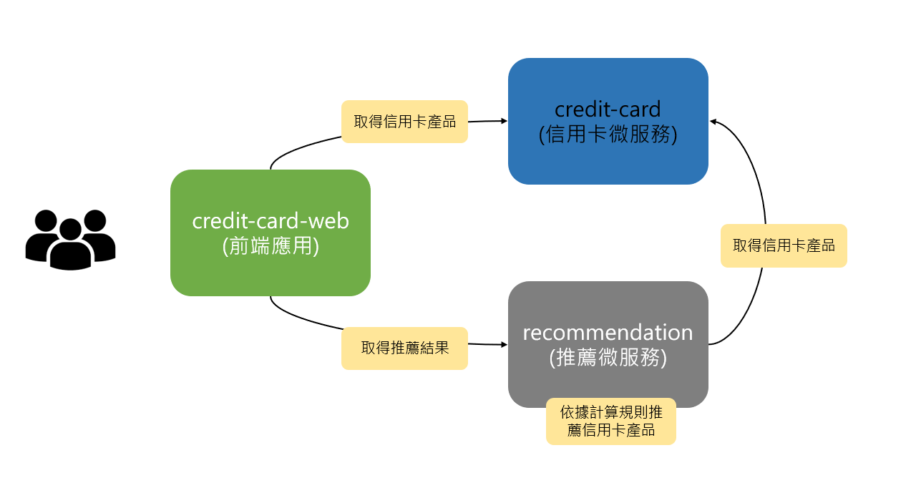

# nccu-lab-2020
2020年政大實驗課程使用的Repository

## Lab 架構如下圖所示

### credit-card (信用卡微服務)
- 提供新增/修改/查詢/刪除信用卡產品之功能。
- 此模組將由講師預先為同學準備好。
### recommendation (推薦微服務)
- 此模組將呼叫credit-card (信用卡微服務)，取得信用卡產品後將依照模組內的推薦規則回傳得分較高的前三名推薦給終端使用者。
- 此模組將由同學於課堂中進行佈署，並創建CI/CD Pipeline，在修改推薦規則的過程中體驗CI/CD Pipeliene帶來的好處。
### credit-card-web (前端應用)
- 本前端頁面分為上下兩部分。
- 上部分: 顯示信用卡產品。
- 下部分: 顯示推薦結果。
- 此模組將由講師預先為同學準備好。
